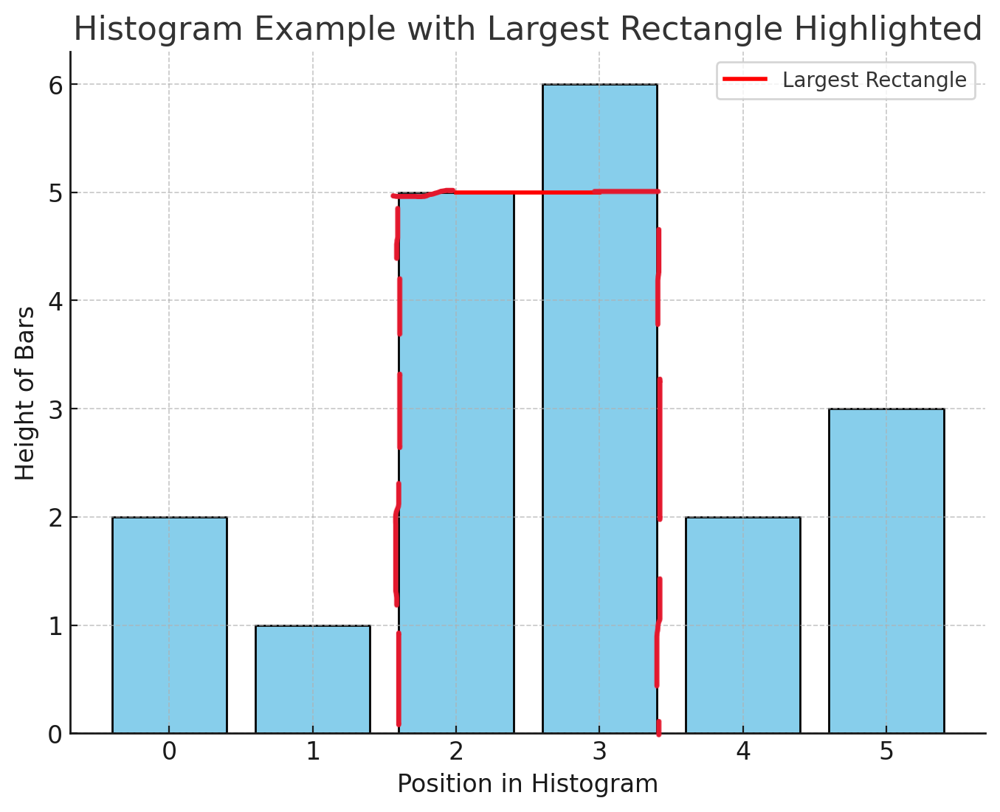

# Exercise: Find the Largest Rectangle in a Histogram

## Description  
Given an array of positive integers representing the heights of bars in a histogram, write a function to find the largest rectangular area that can be formed within the histogram.

## Examples  

1. **Input:**  
   `[2, 1, 5, 6, 2, 3]`  
   **Output:**  
   `10`  
   **Explanation:** The largest rectangle is formed by the bars `[5, 6]` with a height of `5` and width of `2`, giving an area of `5 × 2 = 10`.  

2. **Input:**  
   `[2, 4]`  
   **Output:**  
   `4`  
   **Explanation:** The largest rectangle is formed by the bar of height `4` with width `1`, giving an area of `4 × 1 = 4`.  

3. **Input:**  
   `[1, 2, 3, 4, 5]`  
   **Output:**  
   `9`  
   **Explanation:** The largest rectangle is formed by the bars `[3, 4, 5]` with height `3` and width `3`, giving an area of `3 × 3 = 9`.  

4. **Input**
    `[]`
    **Output**

## Constraints  
- The input array will contain at least one bar.  
- The heights will be positive integers.  
- The function should run efficiently for large inputs.
        